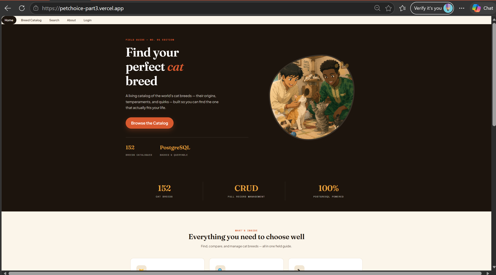
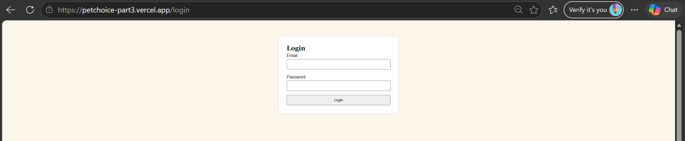
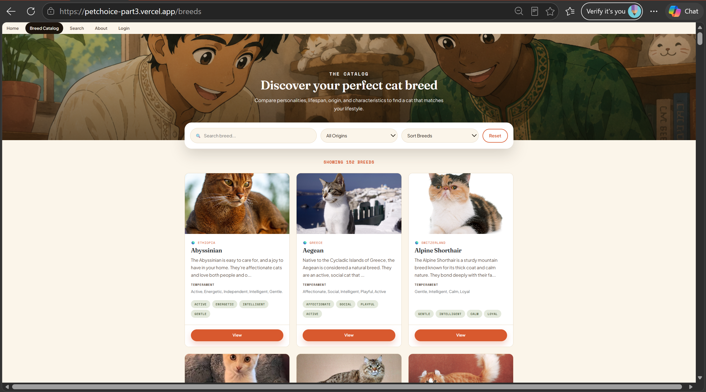
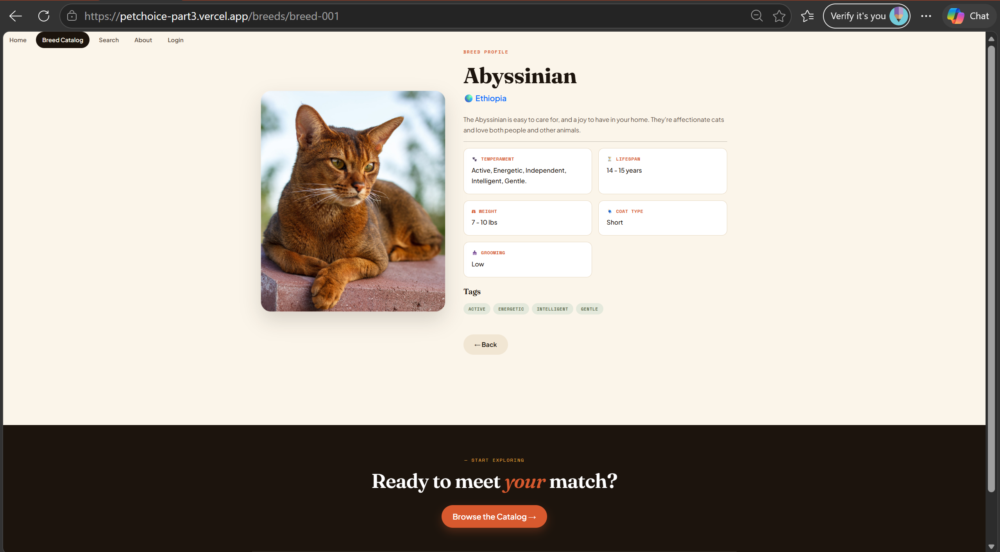
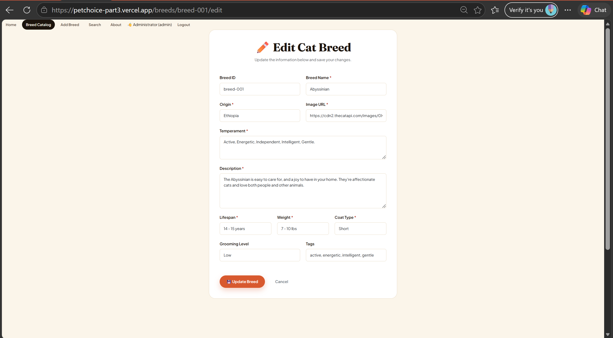

# 🐱 PetChoice – Cat Breed Management System

<div align="center">


**WEB700 - Web Programming**

**Business Information Technology**

**Seneca Polytechnic**

Summer 2026

### 🔗 [Live Demo](https://petchoice-part3.vercel.app/)

</div>

---

# 📚 Table of Contents

- Project Overview
- Live Demo
- Project Objectives
- Application Features
- Technology Stack
- System Architecture
- Database Design
- Authentication & Security
- REST API
- Installation
- Environment Variables
- Default User Accounts
- Project Structure
- Application Pages
- CRUD Operations
- Security Features
- Testing
- Security Verification Report
- Future Enhancements
- Authors

---

# 📖 Project Overview

PetChoice is a full-stack web application that enables users to discover, browse, search, and manage information about cat breeds behind secure member accounts.

The application was developed as the final project for **WEB700 – Web Programming** at **Seneca Polytechnic**.

The goal of the project is to demonstrate practical knowledge of:

- Full Stack Web Development
- RESTful API Design
- Database Management
- Authentication & Authorization
- Secure Web Programming (CSRF protection, rate limiting, OTP-based account recovery)
- MVC Design Pattern
- CRUD Operations
- Responsive Web Design

The application integrates PostgreSQL with Node.js using Sequelize ORM and provides a secure authentication system — registration, login/logout, self-service password changes, OTP-based password recovery, and role-based access control — backed by Postgres-persisted sessions.

---

# 🚀 Live Demo

The application is deployed and publicly accessible on Vercel:

🔗 **[https://petchoice-part3.vercel.app/](https://petchoice-part3.vercel.app/)**

Create a free account, or use the [Default User Accounts](#-default-user-accounts) below to log in and explore both Administrator and Viewer roles.

---

# 🎯 Project Objectives

The primary objectives of PetChoice are:

- Build a complete CRUD application
- Connect to a PostgreSQL database
- Implement Sequelize ORM
- Build REST API endpoints
- Develop a responsive UI using Bootstrap
- Secure the application using authentication
- Implement role-based authorization
- Protect administrator routes
- Restrict the breed catalog to registered, logged-in users
- Provide self-service account recovery via a one-time verification code
- Harden the application against CSRF and brute-force attacks
- Follow modern Node.js development practices

---

# ✨ Application Features

## 🐱 Breed Catalog

Once logged in, users can:

- Browse all available cat breeds
- View detailed breed information
- Search breeds
- Sort breeds alphabetically
- Filter breeds by origin
- View breed characteristics

Each breed displays:

- Breed Name
- Image
- Origin
- Description
- Temperament
- Lifespan
- Weight
- Coat Type
- Grooming Level
- Tags

The catalog, search, and breed detail pages all require an active login — guests are redirected to the login page.

---

## ✏ Administrator Features

Administrator users can:

- Register, login, logout
- Browse and search breeds
- Add new breeds
- Edit existing breeds
- Delete breeds
- Change their own password
- Recover their password via a one-time email code
- View the Admin Dashboard (total breeds, total users, admins vs. viewers, top breed origins, recently added breeds, and a full user account list)

---

## 👤 Viewer Features

Viewer users can:

- Register, login, logout
- Browse breeds
- Search breeds
- View breed information
- Change their own password
- Recover their password via a one-time email code

Viewer users cannot:

- Add breeds
- Edit breeds
- Delete breeds
- Access the Admin Dashboard

---

## 🔐 Account & Security Features

- **Register** — anyone can create a free account (name, email, optional phone, password). New accounts are always created with the Viewer role; Administrator accounts are seeded, not self-assigned.
- **Change Password** — available to both roles, requires the current password before setting a new one.
- **Forgot Password (OTP)** — a 3-step, email-based one-time code flow: request a code, verify the 6-digit code, then set a new password. Codes expire after 10 minutes and are stored bcrypt-hashed, never in plaintext.
- **CSRF Protection** — every form submits a session-bound token, verified on the server before any state-changing request is processed.
- **Rate Limiting** — login, registration, and OTP requests are throttled to blunt brute-force and spam attempts.

---

# 💻 Technology Stack

## Backend

- Node.js
- Express.js
- Sequelize ORM
- PostgreSQL (Neon)

## Frontend

- HTML5
- CSS3
- Bootstrap 5
- EJS
- JavaScript

## Security

- bcrypt.js — password & OTP hashing
- Express Session, backed by `connect-pg-simple` (Postgres-persisted sessions)
- Helmet — HTTP security headers, including an active Content Security Policy
- express-rate-limit — brute-force / spam throttling on auth routes
- Node's built-in `crypto` module — one-time code generation
- nodemailer — optional real email delivery for OTP codes
- dotenv

## Development Tools

- Git
- GitHub
- VS Code
- Postman
- Neon PostgreSQL
- Vercel

---

# 🏗 System Architecture

```
Browser
      │
      ▼
Express Server
      │
      ▼
Application Routes
      │
      ▼
Sequelize ORM
      │
      ▼
PostgreSQL Database
```

The application follows the MVC (Model-View-Controller) architecture.

Models manage database operations.

Views render dynamic web pages using EJS.

Controllers (Routes) process user requests.

---

# 🗄 Database Design

## breeds Table

| Column | Description |
|----------|------------|
| id | Breed ID |
| name | Breed Name |
| origin | Country of Origin |
| temperament | Breed Personality |
| description | Breed Description |
| imageUrl | Image URL |
| lifespan | Average Lifespan |
| weight | Average Weight |
| coatType | Coat Type |
| groomingLevel | Grooming Requirements |
| tags | Additional Characteristics |

---

## users Table

| Column | Description |
|----------|------------|
| id | User ID |
| name | User Name |
| email | User Email (unique) |
| password | bcrypt Hashed Password |
| role | Administrator / Viewer |
| phone | Phone Number (optional, unique — collected at registration) |
| reset_otp_hash | bcrypt-hashed one-time password reset code |
| reset_otp_expires_at | Expiry timestamp for the active reset code |

---

## session Table

Auto-created by `connect-pg-simple` on first run. Stores active login sessions in Postgres instead of server memory, so sessions survive serverless cold starts on Vercel.

---

# 🔐 Authentication & Authorization

The application implements secure authentication using:

- bcrypt password hashing
- Express Session, persisted in Postgres (`connect-pg-simple`) rather than in-memory
- Session cookies
- CSRF-protected forms (session-bound tokens, verified on every POST)
- Rate-limited login, registration, and OTP endpoints
- Protected routes
- Role-based middleware (`requireLogin`, `requireAdmin`)

## Account Flows

- **Register** (`/register`) — creates a Viewer account and signs the user in immediately.
- **Login / Logout** (`/login`, `/logout`)
- **Change Password** (`/change-password`) — requires the current password; available to both roles.
- **Forgot Password** (`/forgot-password` → `/verify-otp` → `/reset-password`) — a one-time 6-digit code identifies the account by email. In demo mode (no email service configured) the code is shown directly on screen and logged server-side; if `SMTP_*` variables are set in `.env`, the code is also emailed for real.

## Roles

Two roles exist within the application.

### Administrator

Has full access to CRUD operations and the Admin Dashboard.

### Viewer

Has read-only access to the breed catalog.

Passwords are never stored in plaintext.

---

# 🌐 REST API

## Retrieve All Breeds

```
GET /api/breeds
```

Returns every breed stored in the database. Requires an active login session — an unauthenticated request receives `401 { "error": "Authentication required." }` instead of a redirect.

---

## Retrieve Single Breed

```
GET /api/breeds/:id
```

Returns detailed information for one breed. Also requires an active login session.

---

## Health Check

```
GET /api/health
```

Returns database connectivity status. Not authentication-protected (diagnostic endpoint).

---

# 🚀 Installation

## Prerequisites

Before installing, make sure the following are set up on your machine:

- **Node.js** (v22.x or later) and **npm** — [Download Node.js](https://nodejs.org/)

  Verify your installation:

  ```bash
  node -v
  npm -v
  ```

- A **PostgreSQL** database (this project uses [Neon](https://neon.tech/))
- **Git** installed locally

---

## 1. Clone the repository

```bash
git clone https://github.com/dmpatel90/Petchoice-Part3.git
cd Petchoice-Part3
```

---

## 2. Install dependencies

Install all required packages in one step:

```bash
npm install
```

This installs every dependency listed in `package.json`, including:

| Package | Purpose |
|---|---|
| `express` | Web server framework |
| `sequelize` | ORM for PostgreSQL |
| `pg` / `pg-hstore` | PostgreSQL driver for Sequelize |
| `ejs` | Server-rendered view templates |
| `bcryptjs` | Password & OTP hashing |
| `express-session` | Session-based authentication |
| `connect-pg-simple` | Persists sessions to Postgres instead of server memory |
| `express-rate-limit` | Throttles login / register / OTP requests |
| `helmet` | Secures the app by setting HTTP response headers, including CSP |
| `nodemailer` | Optional real email delivery for OTP codes |
| `dotenv` | Loads environment variables from `.env` |

---

## 3. Configure environment variables

Copy `.env.example` to `.env` and fill in real values:

```env
# Your Neon PostgreSQL connection string.
DATABASE_URL=your_database_url

# Required. The app calls process.exit(1) at startup if this is missing —
# there is no built-in fallback. Generate a value with:
#   node -e "console.log(require('crypto').randomBytes(32).toString('hex'))"
# Use a DIFFERENT value locally than in production, and never commit the
# real value to git.
SESSION_SECRET=your_secret_key

PORT=5500

# development locally; Vercel sets this to "production" automatically on
# deploy, which also makes the session cookie HTTPS-only.
NODE_ENV=development

# Optional — only needed if you want Forgot Password to actually email the
# OTP code instead of just showing it on screen ("demo mode")
SMTP_HOST=smtp.gmail.com
SMTP_PORT=587
SMTP_USER=your-address@gmail.com
SMTP_PASS=your-16-char-app-password
SMTP_FROM=your-address@gmail.com
```

**When deploying to Vercel**, add `DATABASE_URL` and `SESSION_SECRET` under
Project → Settings → Environment Variables (Production) before your first
deploy with this version of the code — the app will crash on every request
if `SESSION_SECRET` isn't set there.

---

## 4. Run the schema migration (one-time)

Registration and password recovery added new columns (`phone`, `reset_otp_hash`, `reset_otp_expires_at`) to the `users` table. If you're pointing at a database that already has a `users` table from an earlier version of this project, bring it up to date once:

```bash
npm run migrate
```

Safe to run again later — it only adds missing columns, it never touches existing data.

---

## 5. Seed default users

```bash
node seedUsers.js
```

---

## 6. Run the application

```bash
node server.js
```

or, using the npm script:

```bash
npm start
```

---

## 7. Open the app

```
http://localhost:5500
```

Or skip local setup entirely and use the live deployment:

```
https://petchoice-part3.vercel.app/
```

---

# 👤 Default User Accounts

Anyone can also [register a free account](/register) — new accounts are always created as Viewer. The accounts below are seeded for demo/testing convenience.

## Administrator

Email

```
admin@petchoice.com
```

Password

```
admin123
```

---

## Viewer

Email

```
viewer@petchoice.com
```

Password

```
viewer123
```

---

# 📂 Project Structure

```
PetChoice
│
├── config
│     database.js
│
├── lib
│     mailer.js
│
├── middleware
│     requireAdmin.js
│     requireLogin.js
│
├── models
│     Breed.js
│     user.js
│     index.js
│
├── public
│     css
│     images
│
├── routes
│     auth.js
│
├── views
│     partials
│     about.ejs
│     adminDashboard.ejs
│     breeds.ejs
│     breedAdd.ejs
│     breedDetails.ejs
│     breedEdit.ejs
│     changePassword.ejs
│     error.ejs
│     forgotPassword.ejs
│     index.ejs
│     login.ejs
│     register.ejs
│     resetPassword.ejs
│     search.ejs
│     verifyOtp.ejs
│
├── screenshots
│     image.png
│     image-1.png
│     image-2.png
│     image-3.png
│     image-4.png
│     image-5.png
│
├── .env.example
├── migrate.js
├── seed.js
├── seedUsers.js
├── server.js
├── verify-production.js
├── vercel.json
├── package.json
├── README.md
└── SECURITY_VERIFICATION.md
```

`middleware/requireAdmin.js` and `middleware/requireLogin.js` are currently
unused — the real auth middleware lives in `routes/auth.js`, which is what
`server.js` imports.

---

# 📄 Application Pages

Home Page

Displays project introduction, live member/breed counts, and navigation.

---

Breed Catalog

Displays all available breeds. Requires login.

---

Breed Details

Displays complete breed information. Requires login.

---

Search Page

Allows searching by breed name, origin, temperament, coat type, and grooming level. Requires login.

---

Add Breed

Administrator only.

---

Edit Breed

Administrator only.

---

Delete Breed

Administrator only.

---

Admin Dashboard

Administrator only — total breeds, total users, admin/viewer counts, top breed origins, recently added breeds, and the full user account list.

---

Register

Create a free account (Viewer role).

---

Login

Allows users to authenticate.

---

Forgot Password

Request a one-time verification code by email.

---

Verify Code

Enter the 6-digit code sent (or shown in demo mode) to continue account recovery.

---

Reset Password

Set a new password after verifying the code.

---

Change Password

Update your password while logged in (requires current password).

---

About

Project information.

---

Error Page

Displays custom application errors — internal error details are logged server-side only, never shown to the user.

---

# 🔒 Security Features

| Feature | Status | Evidence |
|---|---|---|
| Helmet with an active, scoped Content Security Policy (not disabled) | ✅ Verified | `CSP` header present on every response — [SECURITY_VERIFICATION.md §2.2](./SECURITY_VERIFICATION.md#22-content-security-policy-header-is-present-evidence-for-fix-4) |
| Postgres-backed sessions (`connect-pg-simple`), not `MemoryStore` | ✅ Verified | Live in the `session` table; row disappears on logout — [§2.6](./SECURITY_VERIFICATION.md#26-logout-destroys-the-session-evidence-for-fix-5--persistent-store-requirement) |
| `SESSION_SECRET` from environment only, no hard-coded fallback | ✅ Verified | App refuses to start without it — [§2.1](./SECURITY_VERIFICATION.md#21-startup-fails-without-session_secret-evidence-for-fix-1--2) |
| CSRF protection (session-bound token on every state-changing form) | ✅ Verified | 403 confirmed with a *valid* CSRF token on viewer-denied routes — [§2.4](./SECURITY_VERIFICATION.md#24-viewer-is-denied-on-admin-only-routes-via-direct-url-evidence-for-the-viewer-denial-requirement) |
| Rate limiting (login, registration, OTP requests) | ✅ Implemented | `express-rate-limit` on `/login`, `/register`, `/forgot-password`, `/verify-otp` — not yet load-tested to its limit |
| bcrypt password hashing | ✅ Verified | Login/registration only ever compare against `bcrypt.compare`; no plaintext password column |
| Logout destroys the session (server-side, not just the cookie) | ✅ Verified | Session row confirmed deleted from Postgres, not just cookie cleared — [§2.6](./SECURITY_VERIFICATION.md#26-logout-destroys-the-session-evidence-for-fix-5--persistent-store-requirement) |
| Role-based authorization; viewers denied add/edit/delete via direct URL | ✅ Verified | 403 on all five admin-only routes, database confirmed unchanged — [§2.4](./SECURITY_VERIFICATION.md#24-viewer-is-denied-on-admin-only-routes-via-direct-url-evidence-for-the-viewer-denial-requirement) |
| Protected routes — breed catalog requires login | ✅ Verified | Anonymous requests to `/breeds`, `/breeds/add`, `/admin/dashboard`, `/change-password` all 302 to `/login` — [§2.3](./SECURITY_VERIFICATION.md#23-anonymous-users-are-denied-on-protected-routes) |
| Sanitized error messages (no internals leaked to users) | ✅ Implemented | Every `catch` block logs the real error server-side and renders a generic message |
| Secrets excluded from git | ✅ Verified | `.env` is git-ignored; `.env.example` contains placeholders only (previously leaked a real credential — since rotated, see [SECURITY_VERIFICATION.md](./SECURITY_VERIFICATION.md)) |

Full evidence, including exact routes, HTTP methods, and status codes for
every row above, is in **[SECURITY_VERIFICATION.md](./SECURITY_VERIFICATION.md)**.
That document also includes `verify-production.js`, a script that runs the
same checks against the live Vercel deployment.

---

# 🧪 Testing

| Area | Status | How it was verified |
|---|---|---|
| CRUD operations (create/read/update/delete breeds) | ✅ Verified | Real Postgres writes confirmed by direct `SELECT` after each operation — [SECURITY_VERIFICATION.md §2.5](./SECURITY_VERIFICATION.md#25-admin-crud-works-end-to-end-against-the-real-database) |
| PostgreSQL connection | ✅ Verified | `/api/health` + every route above hit a real database, not a mock |
| Registration | ✅ Implemented | Manual click-through during development; not covered by `verify-production.js` |
| Authentication (login) | ✅ Verified | 302 on valid credentials, session cookie issued — [§2.4](./SECURITY_VERIFICATION.md#24-viewer-is-denied-on-admin-only-routes-via-direct-url-evidence-for-the-viewer-denial-requirement) |
| Authorization (admin vs. viewer) | ✅ Verified | 403 on all admin-only routes when accessed as viewer, via direct URL — [§2.4](./SECURITY_VERIFICATION.md#24-viewer-is-denied-on-admin-only-routes-via-direct-url-evidence-for-the-viewer-denial-requirement) |
| Logout / session destruction | ✅ Verified | Session row confirmed deleted from Postgres — [§2.6](./SECURITY_VERIFICATION.md#26-logout-destroys-the-session-evidence-for-fix-5--persistent-store-requirement) |
| Change password | ✅ Implemented | Manual click-through during development |
| Forgot password / OTP verification | ✅ Implemented | Manual click-through during development (wrong-code rejection, correct-code acceptance, reset, re-login) |
| Route protection | ✅ Verified | Anonymous and viewer denial both confirmed with exact status codes — see above |
| CSRF protection | ✅ Verified | Missing/invalid token rejected with 403; valid token accepted — [§2.4](./SECURITY_VERIFICATION.md#24-viewer-is-denied-on-admin-only-routes-via-direct-url-evidence-for-the-viewer-denial-requirement) |
| REST API (`/api/breeds`) | ✅ Implemented | Requires login (401 JSON if not); manually verified |
| Search | ✅ Implemented | Manual click-through during development |
| Error handling | ✅ Verified | 403/404/500 paths all render generic messages; real errors only appear in server logs |
| **Live production deployment (Vercel)** | ⏳ **Pending — run `verify-production.js` yourselves and paste the output into `SECURITY_VERIFICATION.md §3`** | Cannot be verified from an AI sandbox (no outbound network access to the live URL) — must be run from your own machine before presenting |

"✅ Verified" means it was checked with a real running server against a real
PostgreSQL database, with the exact command/route/status code recorded in
`SECURITY_VERIFICATION.md`. "✅ Implemented" means the code path exists and
was exercised manually during development, but doesn't have a recorded
route-by-route evidence trail the way the security-critical paths do.

**Before presenting: run `node verify-production.js` against the deployed
Vercel URL and paste the output into `SECURITY_VERIFICATION.md`.** Everything
above was verified against a local database with the same codebase that runs
on Vercel — but that is not the same as testing the live deployment itself.

---

# 📋 Security Verification Report

[SECURITY_VERIFICATION.md](./SECURITY_VERIFICATION.md) is the detailed,
route-by-route evidence report for every claim in the Security Features and
Testing tables above — what was fixed, exactly how each fix was tested
(with real routes and real HTTP status codes against a real Postgres
database), and `verify-production.js`, a script to gather the same evidence
against the live Vercel deployment.

---

# 🚧 Future Enhancements

The following features are not yet implemented:

- Favorites
- Profile Management
- Search History
- Recently Viewed Breeds
- Expanded Dashboard Analytics (charts/trends over time)
- Pagination
- Image Upload (currently image URLs only)
- Email Verification at signup
- OTP-based Two-Factor Login (currently OTP is used for password recovery only)
- Automated Test Suite (unit/integration tests)
- Improved Mobile UI

---

# 📸 Screenshots

Screenshots are stored in [`/screenshots`](./screenshots) and embedded below.

### Home Page


### Login


### Breed Catalog


### Breed Details


### Add Breed (Administrator)


### Edit Breed (Administrator)


> Screenshots above predate Register, Forgot Password/OTP, Change Password, and the Admin Dashboard — worth adding fresh ones of those pages before final submission.

---

# 👨‍💻 Authors

## Devkumar Manishkumar Patel

Business Information Technology

Seneca Polytechnic

---

## Ebuka Precious Akaegbusi

Business Information Technology

Seneca Polytechnic

---

# 🎓 Course Information

**Course**

WEB700 – Web Programming

**Program**

Business Information Technology

**Institution**

Seneca Polytechnic

**Semester**

Summer 2026

---

# 📜 License

This project was developed for educational purposes as part of the WEB700 Web Programming course at Seneca Polytechnic.

No commercial use is intended.

---

<div align="center">

### ⭐ Thank you for visiting the PetChoice repository!

🔗 **[Try the Live Demo](https://petchoice-part3.vercel.app/)**

If you found this project interesting, feel free to explore the code and provide feedback.

</div>
